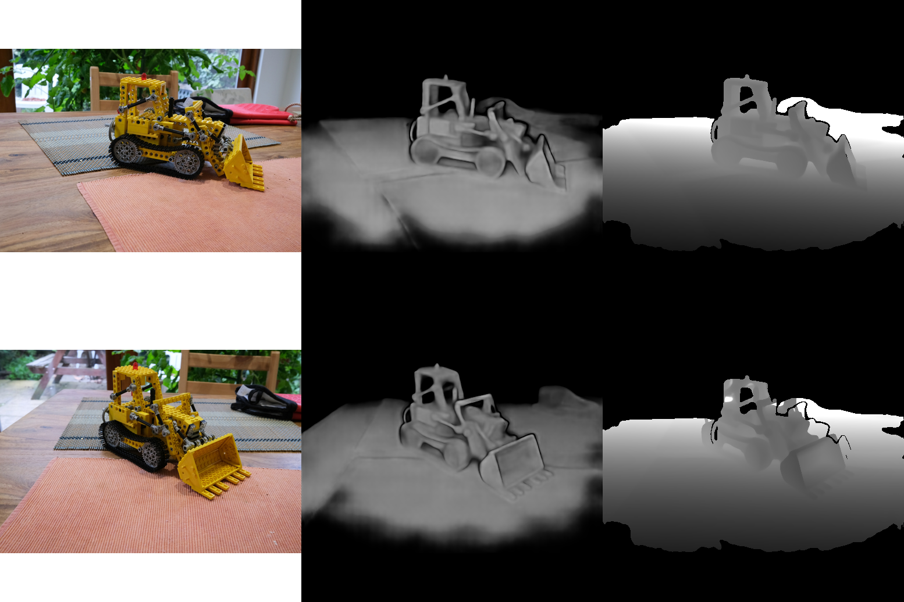

# vggt-onnx

This repo provides a script to export [VGGT](https://vgg-t.github.io/) to ONNX.
Tiny modifications have been done to the upstream code to enable ONNX export.
The model uses float32 weights and supports a dynamic number of input images.

## Usage

### Download ONNX model

The ONNX model is hosted on
[Hugging Face](https://huggingface.co/akretz/VGGT-1B-onnx). You can download it
via

```bash
wget https://huggingface.co/akretz/VGGT-1B-onnx/resolve/main/vggt.onnx
wget https://huggingface.co/akretz/VGGT-1B-onnx/resolve/main/vggt.onnx_data
```

### Run ONNX model

The model can now be run via the ONNX Runtime. Here is an example usage:

```bash
pip install onnxruntime

# Needed for image preprocessing
wget https://raw.githubusercontent.com/facebookresearch/vggt/refs/heads/main/vggt/utils/load_fn.py
pip install torchvision Pillow

# Let's get some example images
wget -O 00.png https://github.com/facebookresearch/vggt/blob/main/examples/kitchen/images/00.png?raw=true
wget -O 01.png https://github.com/facebookresearch/vggt/blob/main/examples/kitchen/images/01.png?raw=true
```

and then

```python
import numpy as np
import onnxruntime as ort
from PIL import Image
from load_fn import load_and_preprocess_images

images = load_and_preprocess_images(["00.png", "01.png"], "pad").numpy()
ort_sess = ort.InferenceSession("vggt.onnx")
outputs = ort_sess.run(None, {"input_images": images})

# The input images
Image.fromarray((np.moveaxis(images[0], 0, 2) * 255.0).astype(np.uint8)).show("Image 1")
Image.fromarray((np.moveaxis(images[1], 0, 2) * 255.0).astype(np.uint8)).show("Image 2")

# The output depth maps with confidences
depth1 = outputs[1][0, 0, ..., 0]
depth2 = outputs[1][0, 1, ..., 0]
depth_conf1 = outputs[2][0, 0]
depth_conf2 = outputs[2][0, 1]
Image.fromarray((depth_conf1 - 1.0) * 10.0).show("Depth Confidence 1")
Image.fromarray((depth_conf2 - 1.0) * 10.0).show("Depth Confidence 2")
Image.fromarray((depth1 - 0.5) * 255.0 * (depth_conf1 > 2.)).show("Depth 1")
Image.fromarray((depth2 - 0.5) * 255.0 * (depth_conf1 > 2.)).show("Depth 2")
```



## TODO

- Get rid of the `load_and_preprocess_images()` dependency
